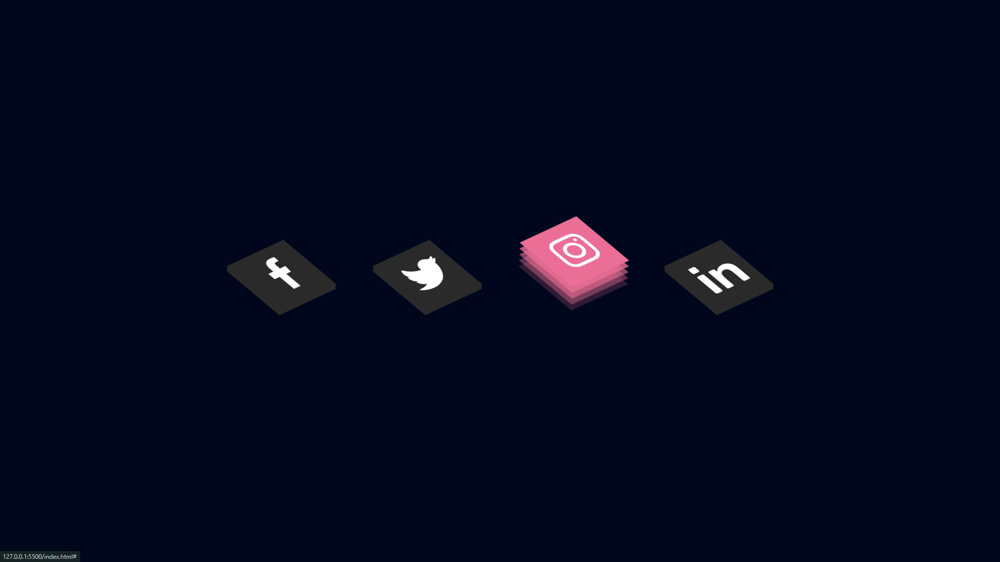

<h1 align="center">3d Social Icons</h1>

  <h3>
    <a href="https://gh0stfreak.github.io/Blogr-landing-page-main/" color="white" target="_blank">
      Live
    </a>
   | 
        <a href="https://youtu.be/9Z5J72bHGqQ?si=hXX3V1v80GaJhcSd" target="_blank">
      Reference
    </a>
  </h3>

 

## About The Project

This HTML & CSS only, small project component for 3d Social Icons
  Users should be able to:
 1. View the optimal layout depending on their device's screen size
 2. See hover states for interactive elements

## Built with

- Semantic HTML5 markup
- CSS custom properties
- Flexbox
- Grid
- Mobile-first workflow
